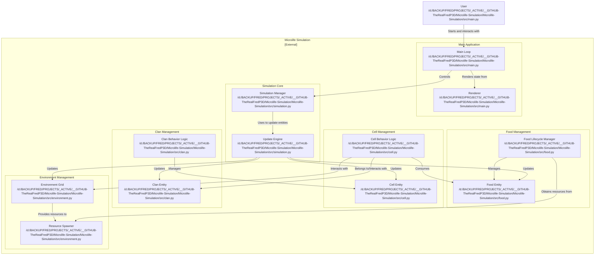

# Unnamed CodeViz Diagram

```mermaid
graph TD

    user["User<br>/d:/BACKUP/FRED/PROJECTS/_ACTIVE/__GITHUB-TheRealFredP3D/Microlife-Simulation/Microlife-Simulation/src/main.py"]
    subgraph microlife_simulation_boundary["Microlife Simulation<br>[External]"]
        subgraph main_app_boundary["Main Application<br>[External]"]
            main_loop["Main Loop<br>/d:/BACKUP/FRED/PROJECTS/_ACTIVE/__GITHUB-TheRealFredP3D/Microlife-Simulation/Microlife-Simulation/src/main.py"]
            renderer["Renderer<br>/d:/BACKUP/FRED/PROJECTS/_ACTIVE/__GITHUB-TheRealFredP3D/Microlife-Simulation/Microlife-Simulation/src/main.py"]
            %% Edges at this level (grouped by source)
            main_loop["Main Loop<br>/d:/BACKUP/FRED/PROJECTS/_ACTIVE/__GITHUB-TheRealFredP3D/Microlife-Simulation/Microlife-Simulation/src/main.py"] -->|"Renders state from"| renderer["Renderer<br>/d:/BACKUP/FRED/PROJECTS/_ACTIVE/__GITHUB-TheRealFredP3D/Microlife-Simulation/Microlife-Simulation/src/main.py"]
        end
        subgraph simulation_core_boundary["Simulation Core<br>[External]"]
            simulation_manager["Simulation Manager<br>/d:/BACKUP/FRED/PROJECTS/_ACTIVE/__GITHUB-TheRealFredP3D/Microlife-Simulation/Microlife-Simulation/src/simulation.py"]
            update_engine["Update Engine<br>/d:/BACKUP/FRED/PROJECTS/_ACTIVE/__GITHUB-TheRealFredP3D/Microlife-Simulation/Microlife-Simulation/src/simulation.py"]
            %% Edges at this level (grouped by source)
            simulation_manager["Simulation Manager<br>/d:/BACKUP/FRED/PROJECTS/_ACTIVE/__GITHUB-TheRealFredP3D/Microlife-Simulation/Microlife-Simulation/src/simulation.py"] -->|"Uses to update entities"| update_engine["Update Engine<br>/d:/BACKUP/FRED/PROJECTS/_ACTIVE/__GITHUB-TheRealFredP3D/Microlife-Simulation/Microlife-Simulation/src/simulation.py"]
        end
        subgraph cell_management_boundary["Cell Management<br>[External]"]
            cell_entity["Cell Entity<br>/d:/BACKUP/FRED/PROJECTS/_ACTIVE/__GITHUB-TheRealFredP3D/Microlife-Simulation/Microlife-Simulation/src/cell.py"]
            cell_behavior_logic["Cell Behavior Logic<br>/d:/BACKUP/FRED/PROJECTS/_ACTIVE/__GITHUB-TheRealFredP3D/Microlife-Simulation/Microlife-Simulation/src/cell.py"]
        end
        subgraph clan_management_boundary["Clan Management<br>[External]"]
            clan_entity["Clan Entity<br>/d:/BACKUP/FRED/PROJECTS/_ACTIVE/__GITHUB-TheRealFredP3D/Microlife-Simulation/Microlife-Simulation/src/clan.py"]
            clan_behavior_logic["Clan Behavior Logic<br>/d:/BACKUP/FRED/PROJECTS/_ACTIVE/__GITHUB-TheRealFredP3D/Microlife-Simulation/Microlife-Simulation/src/clan.py"]
        end
        subgraph environment_management_boundary["Environment Management<br>[External]"]
            environment_grid["Environment Grid<br>/d:/BACKUP/FRED/PROJECTS/_ACTIVE/__GITHUB-TheRealFredP3D/Microlife-Simulation/Microlife-Simulation/src/environment.py"]
            resource_spawner["Resource Spawner<br>/d:/BACKUP/FRED/PROJECTS/_ACTIVE/__GITHUB-TheRealFredP3D/Microlife-Simulation/Microlife-Simulation/src/environment.py"]
            %% Edges at this level (grouped by source)
            environment_grid["Environment Grid<br>/d:/BACKUP/FRED/PROJECTS/_ACTIVE/__GITHUB-TheRealFredP3D/Microlife-Simulation/Microlife-Simulation/src/environment.py"] -->|"Provides resources to"| resource_spawner["Resource Spawner<br>/d:/BACKUP/FRED/PROJECTS/_ACTIVE/__GITHUB-TheRealFredP3D/Microlife-Simulation/Microlife-Simulation/src/environment.py"]
        end
        subgraph food_management_boundary["Food Management<br>[External]"]
            food_entity["Food Entity<br>/d:/BACKUP/FRED/PROJECTS/_ACTIVE/__GITHUB-TheRealFredP3D/Microlife-Simulation/Microlife-Simulation/src/food.py"]
            food_lifecycle_manager["Food Lifecycle Manager<br>/d:/BACKUP/FRED/PROJECTS/_ACTIVE/__GITHUB-TheRealFredP3D/Microlife-Simulation/Microlife-Simulation/src/food.py"]
            %% Edges at this level (grouped by source)
            food_lifecycle_manager["Food Lifecycle Manager<br>/d:/BACKUP/FRED/PROJECTS/_ACTIVE/__GITHUB-TheRealFredP3D/Microlife-Simulation/Microlife-Simulation/src/food.py"] -->|"Manages"| food_entity["Food Entity<br>/d:/BACKUP/FRED/PROJECTS/_ACTIVE/__GITHUB-TheRealFredP3D/Microlife-Simulation/Microlife-Simulation/src/food.py"]
        end
        %% Edges at this level (grouped by source)
        main_loop["Main Loop<br>/d:/BACKUP/FRED/PROJECTS/_ACTIVE/__GITHUB-TheRealFredP3D/Microlife-Simulation/Microlife-Simulation/src/main.py"] -->|"Controls"| simulation_manager["Simulation Manager<br>/d:/BACKUP/FRED/PROJECTS/_ACTIVE/__GITHUB-TheRealFredP3D/Microlife-Simulation/Microlife-Simulation/src/simulation.py"]
        update_engine["Update Engine<br>/d:/BACKUP/FRED/PROJECTS/_ACTIVE/__GITHUB-TheRealFredP3D/Microlife-Simulation/Microlife-Simulation/src/simulation.py"] -->|"Updates"| cell_entity["Cell Entity<br>/d:/BACKUP/FRED/PROJECTS/_ACTIVE/__GITHUB-TheRealFredP3D/Microlife-Simulation/Microlife-Simulation/src/cell.py"]
        update_engine["Update Engine<br>/d:/BACKUP/FRED/PROJECTS/_ACTIVE/__GITHUB-TheRealFredP3D/Microlife-Simulation/Microlife-Simulation/src/simulation.py"] -->|"Updates"| clan_entity["Clan Entity<br>/d:/BACKUP/FRED/PROJECTS/_ACTIVE/__GITHUB-TheRealFredP3D/Microlife-Simulation/Microlife-Simulation/src/clan.py"]
        update_engine["Update Engine<br>/d:/BACKUP/FRED/PROJECTS/_ACTIVE/__GITHUB-TheRealFredP3D/Microlife-Simulation/Microlife-Simulation/src/simulation.py"] -->|"Updates"| environment_grid["Environment Grid<br>/d:/BACKUP/FRED/PROJECTS/_ACTIVE/__GITHUB-TheRealFredP3D/Microlife-Simulation/Microlife-Simulation/src/environment.py"]
        update_engine["Update Engine<br>/d:/BACKUP/FRED/PROJECTS/_ACTIVE/__GITHUB-TheRealFredP3D/Microlife-Simulation/Microlife-Simulation/src/simulation.py"] -->|"Updates"| food_entity["Food Entity<br>/d:/BACKUP/FRED/PROJECTS/_ACTIVE/__GITHUB-TheRealFredP3D/Microlife-Simulation/Microlife-Simulation/src/food.py"]
        cell_behavior_logic["Cell Behavior Logic<br>/d:/BACKUP/FRED/PROJECTS/_ACTIVE/__GITHUB-TheRealFredP3D/Microlife-Simulation/Microlife-Simulation/src/cell.py"] -->|"Interacts with"| environment_grid["Environment Grid<br>/d:/BACKUP/FRED/PROJECTS/_ACTIVE/__GITHUB-TheRealFredP3D/Microlife-Simulation/Microlife-Simulation/src/environment.py"]
        cell_behavior_logic["Cell Behavior Logic<br>/d:/BACKUP/FRED/PROJECTS/_ACTIVE/__GITHUB-TheRealFredP3D/Microlife-Simulation/Microlife-Simulation/src/cell.py"] -->|"Consumes"| food_entity["Food Entity<br>/d:/BACKUP/FRED/PROJECTS/_ACTIVE/__GITHUB-TheRealFredP3D/Microlife-Simulation/Microlife-Simulation/src/food.py"]
        cell_behavior_logic["Cell Behavior Logic<br>/d:/BACKUP/FRED/PROJECTS/_ACTIVE/__GITHUB-TheRealFredP3D/Microlife-Simulation/Microlife-Simulation/src/cell.py"] -->|"Belongs to/Interacts with"| clan_entity["Clan Entity<br>/d:/BACKUP/FRED/PROJECTS/_ACTIVE/__GITHUB-TheRealFredP3D/Microlife-Simulation/Microlife-Simulation/src/clan.py"]
        clan_behavior_logic["Clan Behavior Logic<br>/d:/BACKUP/FRED/PROJECTS/_ACTIVE/__GITHUB-TheRealFredP3D/Microlife-Simulation/Microlife-Simulation/src/clan.py"] -->|"Manages"| cell_entity["Cell Entity<br>/d:/BACKUP/FRED/PROJECTS/_ACTIVE/__GITHUB-TheRealFredP3D/Microlife-Simulation/Microlife-Simulation/src/cell.py"]
        food_lifecycle_manager["Food Lifecycle Manager<br>/d:/BACKUP/FRED/PROJECTS/_ACTIVE/__GITHUB-TheRealFredP3D/Microlife-Simulation/Microlife-Simulation/src/food.py"] -->|"Obtains resources from"| resource_spawner["Resource Spawner<br>/d:/BACKUP/FRED/PROJECTS/_ACTIVE/__GITHUB-TheRealFredP3D/Microlife-Simulation/Microlife-Simulation/src/environment.py"]
    end
    %% Edges at this level (grouped by source)
    user["User<br>/d:/BACKUP/FRED/PROJECTS/_ACTIVE/__GITHUB-TheRealFredP3D/Microlife-Simulation/Microlife-Simulation/src/main.py"] -->|"Starts and interacts with"| main_loop["Main Loop<br>/d:/BACKUP/FRED/PROJECTS/_ACTIVE/__GITHUB-TheRealFredP3D/Microlife-Simulation/Microlife-Simulation/src/main.py"]

```
---
*Generated by [CodeViz.ai](https://codeviz.ai) on 10/11/2025, 10:36:04 PM*
