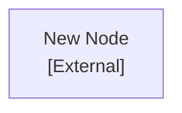

# Unnamed CodeViz Diagram

```mermaid
graph TD

    node-1760394401224["New Node<br>[External]"]

```
# Unnamed CodeViz Diagram

```mermaid
graph TD

    User["Simulator User<br>/README.md"]
    Pygame["Pygame Library<br>/requirements.txt"]
    Python["Python 3.x Runtime<br>/requirements.txt"]
    OperatingSystem["Operating System<br>[External]"]
    subgraph MicrolifeSimulator["MicroLife Evolution Simulator<br>[External]"]
        subgraph SimulationCore["Microlife Simulation Core<br>/src"]
            Main["main.py<br>/src/main.py"]
            Simulation["simulation.py<br>/src/simulation.py"]
            Cell["cell.py<br>/src/cell.py"]
            Clan["clan.py<br>/src/clan.py"]
            Environment["environment.py<br>/src/environment.py"]
            Food["food.py<br>/src/food.py"]
            Constants["constants.py<br>/src/constants.py"]
            Utils["utils.py<br>/src/utils.py"]
            %% Edges at this level (grouped by source)
            Main["main.py<br>/src/main.py"] -->|"Initializes and runs"| Simulation["simulation.py<br>/src/simulation.py"]
            Simulation["simulation.py<br>/src/simulation.py"] -->|"Manages"| Cell["cell.py<br>/src/cell.py"]
            Simulation["simulation.py<br>/src/simulation.py"] -->|"Manages"| Clan["clan.py<br>/src/clan.py"]
            Simulation["simulation.py<br>/src/simulation.py"] -->|"Manages"| Environment["environment.py<br>/src/environment.py"]
            Simulation["simulation.py<br>/src/simulation.py"] -->|"Manages"| Food["food.py<br>/src/food.py"]
            Simulation["simulation.py<br>/src/simulation.py"] -->|"Uses"| Constants["constants.py<br>/src/constants.py"]
            Simulation["simulation.py<br>/src/simulation.py"] -->|"Uses"| Utils["utils.py<br>/src/utils.py"]
        end
        subgraph MutationData["Mutation Data<br>/data"]
            MutationDataFile["mutation\_data.json<br>/data/mutation_data.json"]
        end
        subgraph SimulationLogs["Simulation Logs<br>/logs"]
            LogFiles["Log Files<br>/logs"]
        end
        subgraph SimulationAssets["Simulation Assets<br>/assets"]
            AssetFiles["Image Files<br>/assets"]
        end
        %% Edges at this level (grouped by source)
        Simulation["simulation.py<br>/src/simulation.py"] -->|"Reads and writes | JSON"| MutationDataFile["mutation\_data.json<br>/data/mutation_data.json"]
        Simulation["simulation.py<br>/src/simulation.py"] -->|"Writes | Text"| LogFiles["Log Files<br>/logs"]
        Simulation["simulation.py<br>/src/simulation.py"] -->|"Reads | Image Files"| AssetFiles["Image Files<br>/assets"]
    end
    %% Edges at this level (grouped by source)
    User["Simulator User<br>/README.md"] -->|"Operates and observes using | Keyboard and Mouse"| Main["main.py<br>/src/main.py"]
    Main["main.py<br>/src/main.py"] -->|"Uses for graphics, input, and game loop | Python Library"| Pygame["Pygame Library<br>/requirements.txt"]
    Main["main.py<br>/src/main.py"] -->|"Runs on | Runtime Environment"| Python["Python 3.x Runtime<br>/requirements.txt"]
    Main["main.py<br>/src/main.py"] -->|"Runs within | Operating System"| OperatingSystem["Operating System<br>[External]"]

```
---
*Generated by [CodeViz.ai](https://codeviz.ai) on 10/13/2025, 6:26:46 PM*
